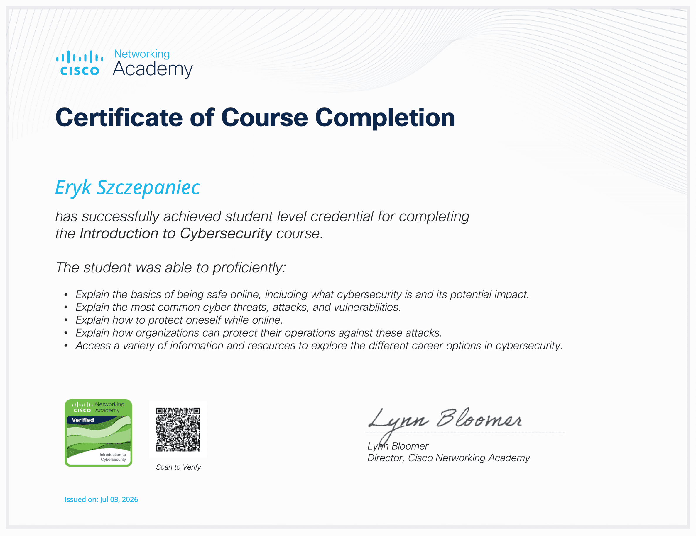

# Cisco Networking Academy — Introduction to Cybersecurity

**Provider:** Cisco Networking Academy
**Status:** Done
**Started:** <!-- add date -->
**Completed:** <!-- add date -->

## Why I'm taking this course

Starting point for building structured knowledge of cybersecurity fundamentals, coming from a web development background. Goal is to get a solid grounding before moving into more hands-on/practical areas (networking, web security).

## Topics covered

<!-- Fill in as you progress through the course modules -->

- [ ] The Cybersecurity Landscape (threats, threat actors, motivations)
- [ ] Fighting Cybercrime (defense strategies, security organizations)
- [ ] The Cybersecurity Cube (CIA triad, security principles)
- [ ] Cybersecurity Threats, Vulnerabilities, and Attacks
- [ ] The Art of Protecting Secrets (cryptography basics)
- [ ] The Art of Ensuring Integrity
- [ ] The Five Nines Concept (availability)
- [ ] Protecting Your Data and Privacy
- [ ] Protecting the Organization (defense-in-depth, security policies)
- [ ] Will Your Future Be in Cybersecurity? (career paths, certifications)

## Key takeaways

<!--
Summarize the most important concepts in your own words as you go,
rather than copying course material verbatim.
-->

- 

## Terms / concepts to remember

| Term | Definition (in my own words) |
|---|---|
|  |  |

## How this connects to what I already know

<!--
e.g. links between CIA triad and things you've already dealt with as a web dev
(OAuth token security, Stripe payment data handling, OWASP ASVS work on Gmail Compressor)
-->

- 

## Certificate

<!-- Add once completed -->

